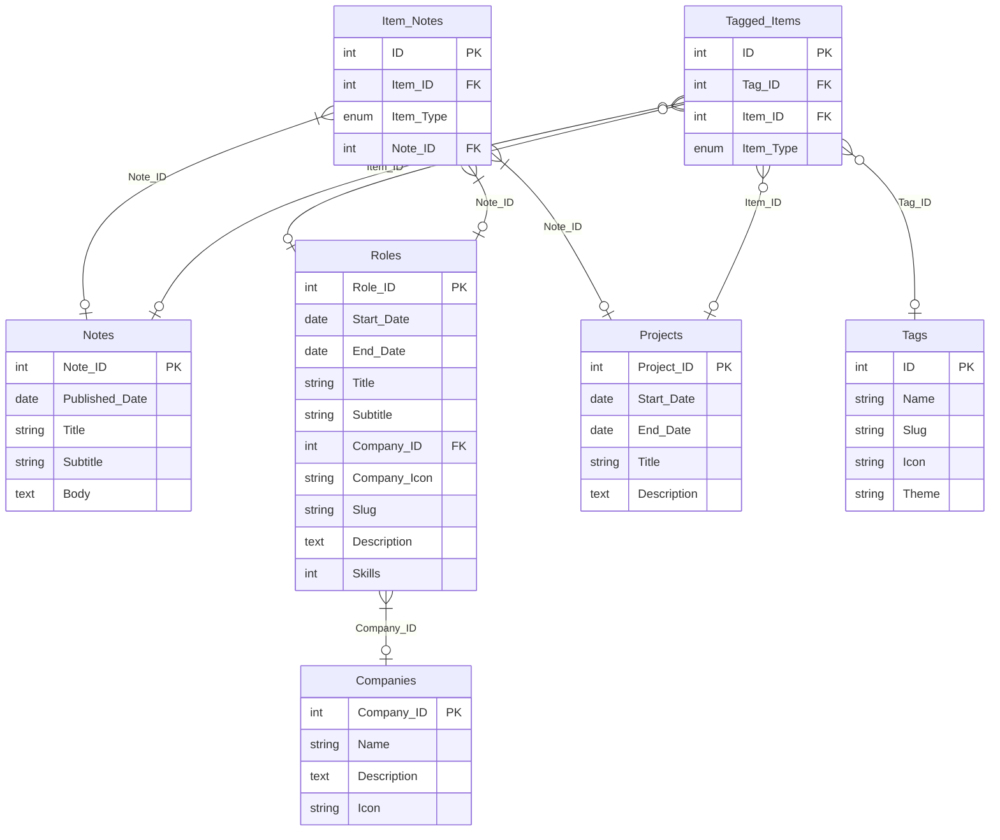

# Data models

The data model defines a number of related entities all used for the website.



# Schema
The SQL for the database is defined below:
```sql
CREATE TABLE IF NOT EXISTS companies (
  id bigserial PRIMARY KEY,
  name text NOT NULL,
  description text,
  icon varchar(2083)
);

CREATE TABLE IF NOT EXISTS roles (
  id bigserial PRIMARY KEY,
  createdAt timestamp(0) with time zone NOT NULL DEFAULT NOW(),
  updatedAt timestamp(0) with time zone NOT NULL DEFAULT NOW(),
  deletedAt timestamp(0) with time zone,
  startDate timestamp(0) with time zone NOT NULL,
  endDate timestamp(0) with time zone,
  title text NOT NULL,
  subtitle text,
  companyId bigint NOT NULL,
  FOREIGN KEY (companyId) REFERENCES companies(id),
  slug varchar(255),
  description text,
  skills text[] NOT NULL
);

CREATE TABLE IF NOT EXISTS projects (
  id bigserial PRIMARY KEY,
  createdAt timestamp(0) with time zone NOT NULL DEFAULT NOW(),
  updatedAt timestamp(0) with time zone NOT NULL DEFAULT NOW(),
  deletedAt timestamp(0) with time zone,
  startDate timestamp(0) with time zone NOT NULL,
  endDate timestamp(0) with time zone,
  title text NOT NULL,
  description text
);

CREATE TABLE IF NOT EXISTS tags (
  id bigserial PRIMARY KEY,
  createdAt  timestamp(0) with time zone NOT NULL DEFAULT NOW(),
  updatedAt timestamp(0) with time zone NOT NULL DEFAULT NOW(),
  deletedAt timestamp(0) with time zone,
  name text NOT NULL,
  slug varchar(255),
  icon varchar(1),
  theme varchar(255)
);

CREATE TABLE IF NOT EXISTS notes (
  id bigserial PRIMARY KEY,
  createdAt  timestamp(0) with time zone NOT NULL DEFAULT NOW(),
  updatedAt timestamp(0) with time zone NOT NULL DEFAULT NOW(),
  deletedAt timestamp(0) with time zone,
  publishedAt timestamp(0) with time zone,
  title text NOT NULL,
  subtitle text,
  body text
);

CREATE TYPE item_type AS ENUM ('notes', 'roles', 'projects');

CREATE TABLE IF NOT EXISTS tagged_items (
  id bigserial PRIMARY KEY,
  tagId bigint NOT NULL,
  itemId bigint NOT NULL,
  itemType item_type NOT NULL,
  FOREIGN KEY (tagId) REFERENCES tags(id)
);

CREATE TABLE IF NOT EXISTS item_notes (
  id bigserial PRIMARY KEY,
  noteId bigint NOT NULL,
  itemId bigint NOT NULL,
  itemType item_type NOT NULL
);

```

## Notes table migration

To create the standalone table that powers the notes feature, apply the following SQL:

```sql
CREATE TABLE IF NOT EXISTS notes (
  id bigserial PRIMARY KEY,
  createdAt  timestamp(0) with time zone NOT NULL DEFAULT NOW(),
  updatedAt timestamp(0) with time zone NOT NULL DEFAULT NOW(),
  deletedAt timestamp(0) with time zone,
  publishedAt timestamp(0) with time zone,
  title text NOT NULL,
  subtitle text,
  body text
);
```
