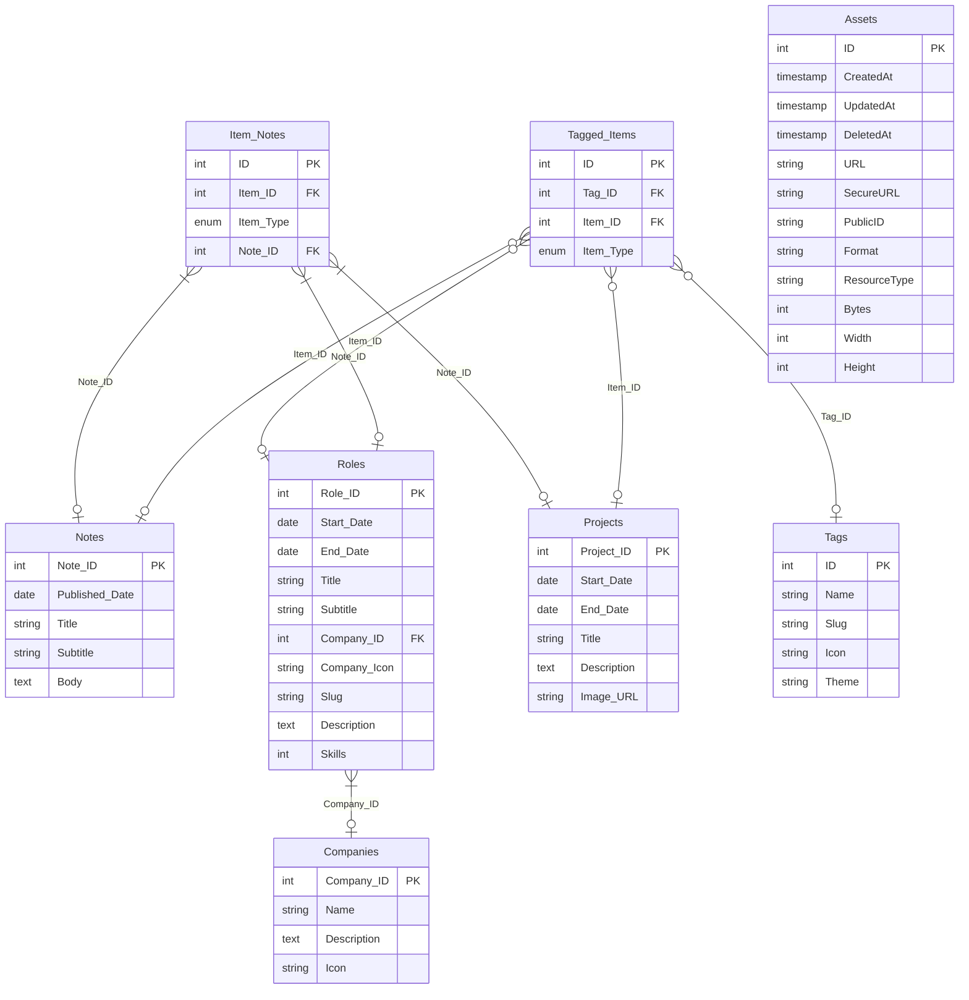

# Data models

The data model defines a number of related entities all used for the website.



# Schema
The SQL for the database is defined below:
```sql
CREATE TABLE IF NOT EXISTS companies (
  id bigserial PRIMARY KEY,
  name text NOT NULL,
  description text,
  icon varchar(2083)
);

CREATE TABLE IF NOT EXISTS roles (
  id bigserial PRIMARY KEY,
  createdAt timestamp(0) with time zone NOT NULL DEFAULT NOW(),
  updatedAt timestamp(0) with time zone NOT NULL DEFAULT NOW(),
  deletedAt timestamp(0) with time zone,
  startDate timestamp(0) with time zone NOT NULL,
  endDate timestamp(0) with time zone,
  title text NOT NULL,
  subtitle text,
  companyId bigint NOT NULL,
  FOREIGN KEY (companyId) REFERENCES companies(id),
  slug varchar(255),
  description text,
  skills text[] NOT NULL
);

CREATE TABLE IF NOT EXISTS projects (
  id bigserial PRIMARY KEY,
  createdAt timestamp(0) with time zone NOT NULL DEFAULT NOW(),
  updatedAt timestamp(0) with time zone NOT NULL DEFAULT NOW(),
  deletedAt timestamp(0) with time zone,
  startDate timestamp(0) with time zone NOT NULL,
  endDate timestamp(0) with time zone,
  title text NOT NULL,
  description text,
  imageUrl text,
  slug varchar(255)
);

CREATE TABLE IF NOT EXISTS tags (
  id bigserial PRIMARY KEY,
  createdAt  timestamp(0) with time zone NOT NULL DEFAULT NOW(),
  updatedAt timestamp(0) with time zone NOT NULL DEFAULT NOW(),
  deletedAt timestamp(0) with time zone,
  name text NOT NULL,
  slug varchar(255),
  icon varchar(1),
  theme varchar(255)
);

CREATE TABLE IF NOT EXISTS notes (
  id bigserial PRIMARY KEY,
  createdAt  timestamp(0) with time zone NOT NULL DEFAULT NOW(),
  updatedAt timestamp(0) with time zone NOT NULL DEFAULT NOW(),
  deletedAt timestamp(0) with time zone,
  publishedAt timestamp(0) with time zone,
  title text NOT NULL,
  subtitle text,
  slug varchar(255),
  body text
);

CREATE TYPE item_type AS ENUM ('notes', 'roles', 'projects');

CREATE TABLE IF NOT EXISTS tagged_items (
  id bigserial PRIMARY KEY,
  tagId bigint NOT NULL,
  itemId bigint NOT NULL,
  itemType item_type NOT NULL,
  FOREIGN KEY (tagId) REFERENCES tags(id)
);

CREATE TABLE IF NOT EXISTS item_notes (
  id bigserial PRIMARY KEY,
  noteId bigint NOT NULL,
  itemId bigint NOT NULL,
  itemType item_type NOT NULL
);

CREATE TABLE IF NOT EXISTS assets (
  id bigserial PRIMARY KEY,
  createdAt timestamp(0) with time zone NOT NULL DEFAULT NOW(),
  updatedAt timestamp(0) with time zone NOT NULL DEFAULT NOW(),
  deletedAt timestamp(0) with time zone,
  url text NOT NULL,
  secureUrl text NOT NULL,
  publicId varchar(255) NOT NULL UNIQUE,
  format varchar(255) NOT NULL,
  resourceType varchar(255) NOT NULL,
  bytes bigint NOT NULL,
  width integer NOT NULL,
  height integer NOT NULL
);

-- Future join tables can link assets to content specific records.
-- Examples are provided below for when the relationships are required:
-- CREATE TABLE IF NOT EXISTS note_assets (
--   noteId bigint NOT NULL REFERENCES notes(id),
--   assetId bigint NOT NULL REFERENCES assets(id),
--   PRIMARY KEY (noteId, assetId)
-- );
-- CREATE TABLE IF NOT EXISTS project_assets (
--   projectId bigint NOT NULL REFERENCES projects(id),
--   assetId bigint NOT NULL REFERENCES assets(id),
--   PRIMARY KEY (projectId, assetId)
-- );
-- CREATE TABLE IF NOT EXISTS role_assets (
--   roleId bigint NOT NULL REFERENCES roles(id),
--   assetId bigint NOT NULL REFERENCES assets(id),
--   PRIMARY KEY (roleId, assetId)
-- );

```

## Project image migration

To extend the projects table with an optional image reference, run the following SQL against existing databases:

```sql
ALTER TABLE projects ADD COLUMN IF NOT EXISTS imageUrl text;
```

Projects can now store the publicly accessible URL returned by the Cloudinary upload flow. Apply the same nullable column pattern to future content tables that need rich images.

## Notes table migration

To create the standalone table that powers the notes feature, apply the following SQL:

```sql
CREATE TABLE IF NOT EXISTS notes (
  id bigserial PRIMARY KEY,
  createdAt  timestamp(0) with time zone NOT NULL DEFAULT NOW(),
  updatedAt timestamp(0) with time zone NOT NULL DEFAULT NOW(),
  deletedAt timestamp(0) with time zone,
  publishedAt timestamp(0) with time zone,
  title text NOT NULL,
  subtitle text,
  body text
);
```

## Assets table migration

To introduce the asset storage table, run the following SQL against existing databases:

```sql
CREATE TABLE IF NOT EXISTS assets (
  id bigserial PRIMARY KEY,
  createdAt timestamp(0) with time zone NOT NULL DEFAULT NOW(),
  updatedAt timestamp(0) with time zone NOT NULL DEFAULT NOW(),
  deletedAt timestamp(0) with time zone,
  url text NOT NULL,
  secureUrl text NOT NULL,
  publicId varchar(255) NOT NULL UNIQUE,
  format varchar(255) NOT NULL,
  resourceType varchar(255) NOT NULL,
  bytes bigint NOT NULL,
  width integer NOT NULL,
  height integer NOT NULL
);

CREATE UNIQUE INDEX IF NOT EXISTS assets_publicId_idx ON assets(publicId);
```

## Slug migration

To add slugs to projects, notes and roles, run the following SQL:

```sql
ALTER TABLE projects ADD COLUMN IF NOT EXISTS slug varchar(255);
ALTER TABLE notes ADD COLUMN IF NOT EXISTS slug varchar(255);
ALTER TABLE roles ADD COLUMN IF NOT EXISTS slug varchar(255);
```
